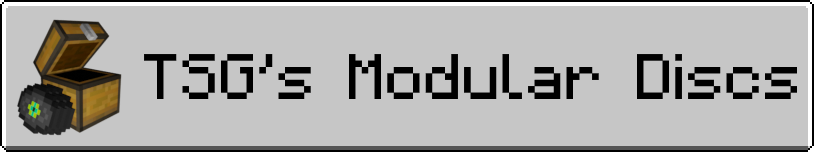

---
### TSG's Modular Discs is a super simple mod that allows you to add music discs from the filesystem.

# How to add existing Disc Packs
1. **In your `.minecraft` folder, find a folder named `discpacks`. If it doesn't exist, you can create it yourself.**
2. **Drag a Disc Pack ZIP file into this folder, and you're done!**

# How to create a Disc Pack
### Disc Packs can only contain 1 Music Disc currently, but that's no worry as you can have as many Disc Packs as you like! To create a Disc Pack:
1. **Create a file named `disc.json` with the following structure**
```json
{
    "name": "Example Artist - Example Song",
    "id": "example_artist_example_song"
}
```
**The `id` field can actually be anything, but make sure it's unique and won't conflict with other Disc Packs!**

2. **Add the music, and make sure it's named as `disc.ogg`**
3. **Optionally, you can add a 16x16 texture named `disc.png`, and it'll show as the disc's custom texture**
4. **ZIP all of the files you made into a .zip file, it can be named whatever you like so long as it doesn't have any spaces!**

### You're done! You've made a disc pack that can be used with TSG's Modular Discs!

# Special Thanks
Special thanks to the [ARPP](https://github.com/Devan-Kerman/ARRP) project, as this mod would not have been possible without it.
